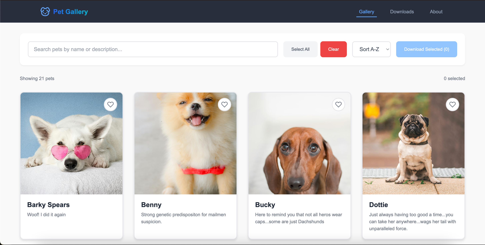
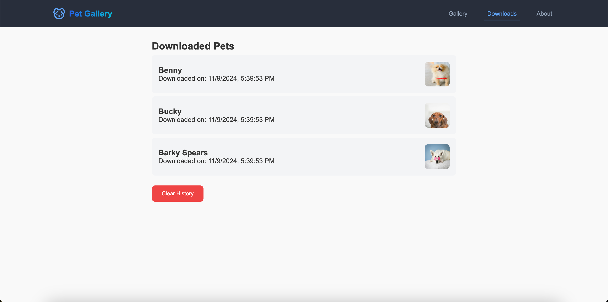
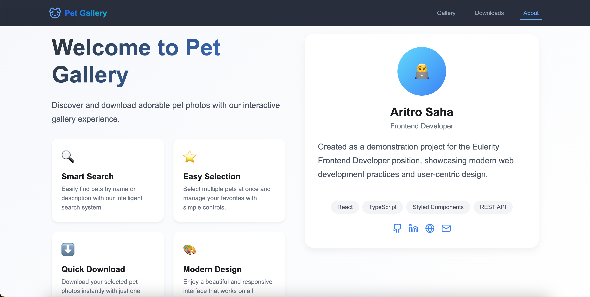

# Pet Gallery App 🐾

A responsive, interactive pet gallery application built with React, TypeScript, styled-components, and react-router-dom, and deployed on Vercel. This app fetches pet images from a public API, displays them in a gallery format, and provides features like image selection, sorting, filtering, bulk download in a zip file, and download history.

## Table of Contents

- [Features](#features)
- [Technologies Used](#technologies-used)
- [Project Structure](#project-structure)
- [Setup and Installation](#setup-and-installation)
- [Usage](#usage)
- [Deployment](#deployment)
- [Screenshots](#screenshots)
- [Signature](#signature)

## Features

- **Fetch and Display Pet Data:** Retrieves pet data from an external API and displays it in a gallery format.
- **Image Selection and Zip Download:** Users can select multiple images and download them as a zip file.
- **Download History:** Downloaded pet details are stored in local storage for later viewing, with an option to clear history.
- **Sorting and Filtering:** Supports sorting by name (A-Z, Z-A) and filtering via a search bar based on title or description.
- **Select All/Clear Selection:** Allows users to easily select all images or clear the current selection.
- **Responsive and Styled:** The UI is designed with styled-components for a clean and responsive look.
- **Custom Hooks:** A custom hook (useFetchPets) is used to handle data fetching and loading states.
- **Client-Side Routing:** Includes an About page, a gallery page, and a downloads page with routing managed by react-router-dom.

## Technologies Used

- **React + TypeScript:** Front-end framework for building the UI.
- **styled-components:** For component-level styling.
- **react-router-dom:** For handling navigation between pages.
- **FileSaver.js:** For downloading files as a zip file.
- **Vercel:** For deployment.
- **Fetch API:** To retrieve data from the external API.

## Project Structure

```
src/
│── App.tsx
│── main.tsx
├── components/
│   ├── PetCard.tsx          # Displays pet image and details with select option
│   ├── Header.tsx           # Page header with navigation links
├── hooks/
│   └── useFetchPets.ts      # Custom hook for fetching and managing pet data
├── pages/
│   ├── Gallery.tsx          # Main page with gallery display and controls
│   ├── About.tsx            # About page with general app information
│   └── Downloads.tsx        # Downloads page for viewing and managing download history
├── context/
│   └── PetContext.tsx       # Context API for global state management
└── styles/
    └── GlobalStyles.ts      # Global CSS styles
```

## Setup and Installation

1. **Clone the Repository:**

    ```bash
    git clone https://github.com/your-username/pet-gallery-app.git
    cd pet-gallery-app
    ```

2. **Install Dependencies:**

    ```bash
    npm install
    ```

3. **Start the Development Server:**

    ```bash
    npm run dev
    ```

    The app should now be running at [http://localhost:5173](http://localhost:5173) by default.

## Usage

1. **Gallery Page:**
   - View a gallery of pet images with names, descriptions, and creation dates.
   - Use the Select All and Clear Selection buttons to manage image selection.
   - Sort the images by name (A-Z, Z-A).
   - Use the Search Bar to filter pets by name or description.
   - Download selected images in a zip file.

2. **Downloads Page:**
   - View details of previously downloaded pets, stored in local storage.
   - Clear all download history with a single button.

3. **About Page:**
   - Access the About page through the navigation header for more information about the app.

## Deployment

This project is designed to be deployed on Vercel. To deploy, follow these steps:

1. **Add a vercel.json File:**

   In the root of the project, add a `vercel.json` file to handle client-side routing:

    ```json
    {
      "rewrites": [
        {
          "source": "/(.*)",
          "destination": "/index.html"
        }
      ]
    }
    ```

2. **Push to GitHub and Deploy on Vercel:**

   Push the project to GitHub, then import the repository into Vercel and deploy.

## Screenshots

| Feature       | Screenshot                  |
|---------------|-----------------------------|
| Gallery Page  |  |
| Downloads Page|  |
| About Page    |     |

## Signature

This project is created by 
```Aritro Saha```
This project is a part of the task given by Eulerity

[GITHUB](https://github.com/halcyon-past) | [LINKEDIN](https://www.linkedin.com/in/aritro-saha/) | [PORTFOLIO](https://aritro.tech/)